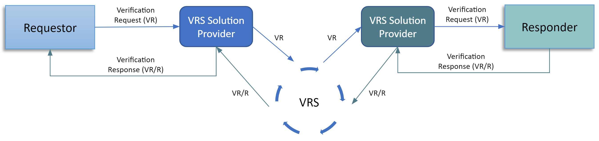
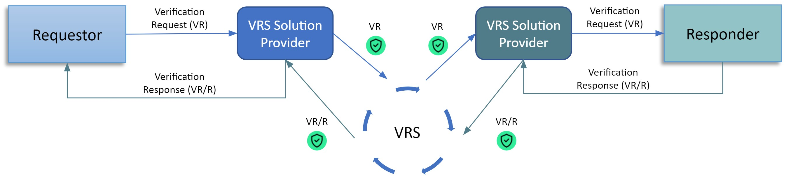
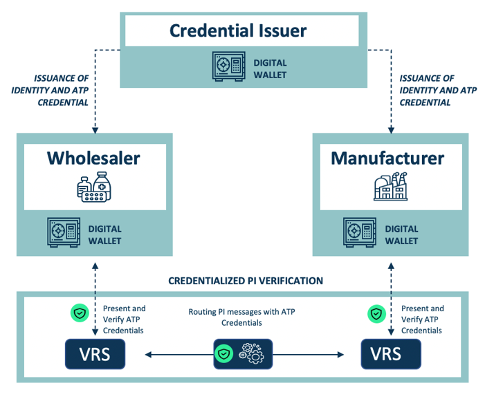
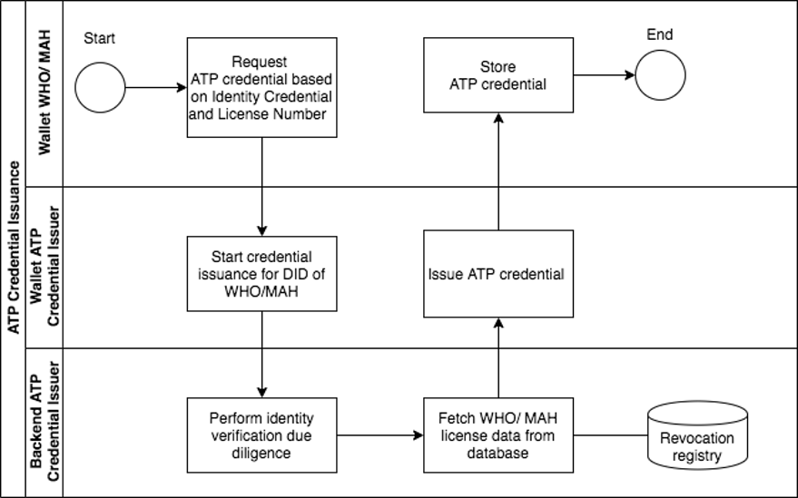
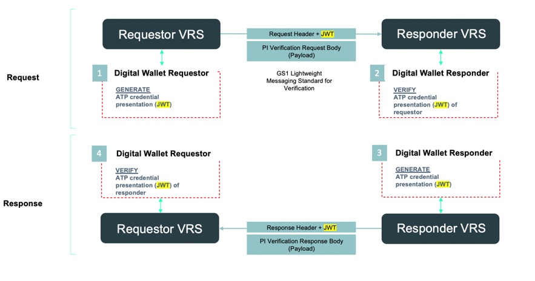
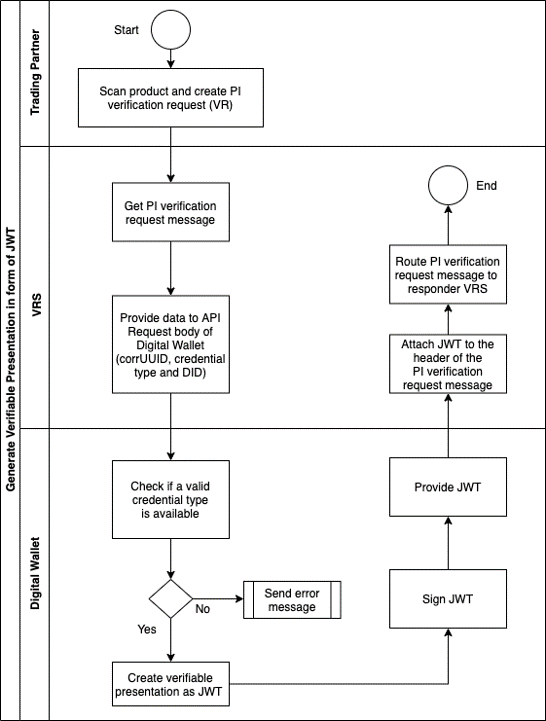
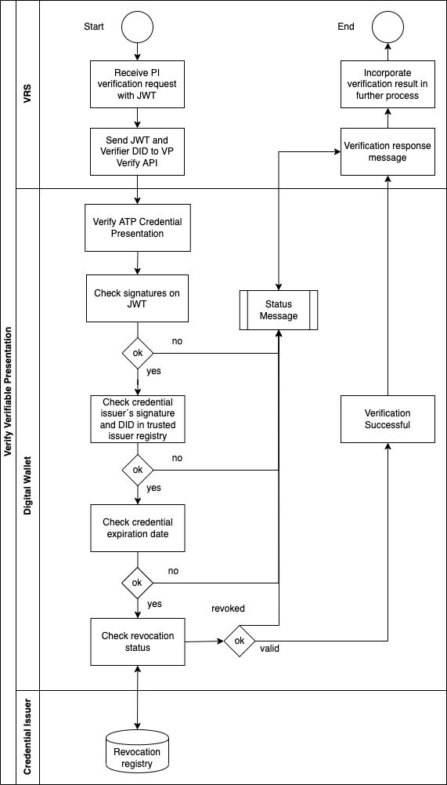
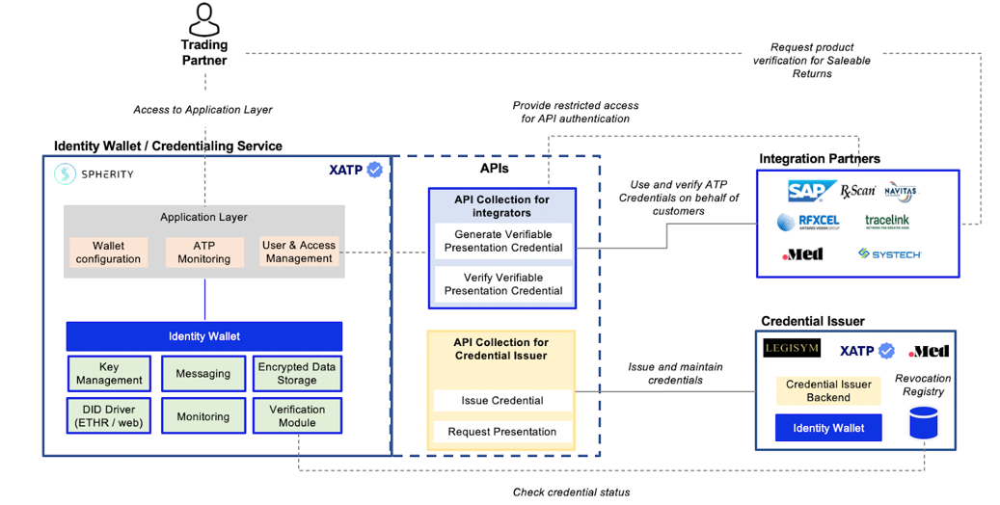

> You can find a web-version of this README here: https://open-credentialing-initiative.github.io/getting-started

# History and Purpose of the Open Credentialing Initiative (OCI)
OCI was formed by a group of industry service providers, manufacturers, wholesalers, and dispensers working together to design and deliver an electronic solution for the pharmaceutical industry to achieve compliance with FDA mandates for supply chain security. Upon successful demonstration of the technical solution, and acceptance by the participating manufacturers and wholesalers, the participants formed the OCI to further develop the solution into a set of tools that could be adopted and implemented across the industry.

The name OCI was chosen for the following reasons:
- **Open** – Non-proprietary and interoperable. OCI is open to all providers, users, and standards organizations that support adoption of the integrated W3C standards and applicable NIST identity proofing standards.
- **Credentialing** – A means of providing a credential that attests to the identity and status of its owner/holder (similar to a license or identity card you carry in your digital wallet). 
- **Initiative** – Indicates that the work is ongoing.

OCI aims to enable pharmaceutical industry compliance with US Drug Supply Chain Security Act (DSCSA) requirements for Authorized Trading Partners (ATP). Beyond supporting the adoption and standardization of the ATP architecture, OCI establishes a structure for running further credential-based pilots and incubation projects. For additional information, please refer to the [Open Credentialing Initiative website](https://www.oc-i.org/).
# Regulatory Compliance – Federal Mandates
The US Drug Supply Chain Security Act (DSCSA) has the objective of securing pharmaceutical drug distribution, from manufacturers all the way to pharmacies. For patient safety, it is essential to know that only trusted and authorized entities are involved in the manufacturing, repackaging, distribution, and dispensing of prescription drugs. In addition to verification, product tracing, and serialization requirements, each supply chain actor must ensure that their Trading Partners are authorized (including indirect Trading Partners).

DSCSA requires that Trading Partners of manufacturers, wholesale distributors, dispensers, repackagers, and third-party logistics providers (3PLs) meet the applicable requirements for being “authorized trading partners” (see sections 582(b)(3), (c)(3), (d)(3), and (e)(3) of the FD&C Act (21 U.S.C. 360eee-1); briefly, “authorized” means registration in accordance with section 510 (manufacturers and repackagers), or having a valid license under State law (wholesalers, 3PLs, and dispensers).
# Digital Ecosystems 
## Identity of Transacting Entities
Verifying that a company is “authorized” is enough to meet the letter of the law. However, in digital ecosystems it is also necessary to establish the identity of the company. Thus, it becomes a two part process – is the counterparty who they say they are, and if so, are they “authorized”? To add to this challenge, DSCSA transactions for Product Identifier (PI) Verification and Transaction Information (TI) Tracing move through any number of intermediaries (solution providers, routing systems, etc.), all of whom fall under the Statute. In a digital ecosystem good design is to limit the opportunity for information leaks, transaction replays, and tampering with the transaction or credential content throughout the ecosystem.
## OCI Credentialing Roles
A **Credential** is a digital assertion containing a set of claims (e.g., about a state license or FDA Establishment Identifier) made by an entity about itself or another entity. A subset of identity data, credentials are cryptographically signed and can be verified. Credentials can be used to create selective disclosures of information (known as “verifiable presentations”) to limit personal data exposure. The entity described by the claims is called the subject of the Credential.

A **holder** can refer to the subject, to others who hold a Credential on behalf of the subject, or to third parties authorized to cache or hold a Credential that has been provided to them.

A **relying party** or **verifier** is generally the entity to whom a verifiable Credential is presented (i.e., the party making decisions based on the claims and their degree of trust in the Credential). A verifier requests a Credential or proof from a holder and verifies it to make a trust decision about the subject entity.

A **Digital Wallet Provider** provides Digital Wallets and connected services to create enterprise identities via decentralized identifiers (DID) for Trading Partners (i.e. Manufacturer, Wholesaler, Dispenser, Repackager, 3PL) and Verifiable Credential Issuers.

A **Verification Router Service** (VRS) provides PI verification routing and PI verification request and response services. The VRS can act on behalf of the holder (when generating a verifiable presentation) or the verifier (when verifying a verifiable presentation).

A **Credential Issuer** is an entity that issues Verifiable Credentials (VC); also known as a Credential Service Provider (CSP). The Credential Issuer is responsible for checking the status of entity registrations and licenses prior to issuing VC to trading partners.

A **regulatory body** is an entity that establishes a legal requirement for the subject to be registered or licensed (i.e., the FDA and States Board of Pharmacy for DSCSA ATP status, and other enforcement agencies as may be applicable).

The following stakeholder roles shall be established within OCI:

| # | Supply Chain Role | Description | OCI Role |
|--- |--- |--- |--- |
| 1 | Identity and ATP license verification provider | - Performs identity and ATP due diligence in accordance with the OCI Credential Issuer Conformance Criteria   - Issues credentials | Credential Issuer |
| 2 | Authorized Trading Partner (ATP) i.e. manufacturer, wholesaler, dispenser, repackager, 3PL | - Uses VRS systems to automate generation and routing of verification request and response messages   - Uses Digital Wallets to acquire and manage ATP credentials   - Requesting ATP sends PI Verification requests. A Requesting ATP may engage a VRS provider to verify a product identifier and, consequently, enable VRS provider to present their ATP VC in the verification request message.   - Responding ATP sends PI Verification responses. A Responding ATP may engage a VRS provider to automate its response to a verification request for a product identifier and, consequently, enable VRS provider to present their ATP VC in the verification response message. | Holder; Verifier |
| 3 | Digital Wallet Provider | - Provides Digital Wallets for ATPs and Credential Issuers   - Provides functionality to issue, revoke and verify credentials   - Provides functionality to present and verify verifiable presentations of credentials   - Maintains verifiable data registry that ensures auditability and compliance of Credential Issuer's due diligence (responsibility shared with Credential Issuer in implementation-specific fashion)   - General Digital Wallet maintenance | Digital Wallet Provider |
| 4 | VRS Provider | - Provides Verification Routing Service following the GS1 Lightweight Messaging Standard (LWMS) for PI Verifications   - Implements or utilizes Digital Wallet to invoke OCI standard ATP credential Application Programming Interface (API) to generate and verify verifiable presentations of ATP credentials   - When representing the ATP credential holder, the VRS provider will add the ATP’s credential presentation to the PI request or response message.   - When representing the ATP credential verifier, the VRS provider will send a verifiable presentation to the verifier's Digital Wallet and process the verification result of the ATP Credential | VRS |
| 5 | Regulator | Acts as a regulatory body to conduct audits and investigations for monitoring and enforcing DSCSA compliance. It is neither expected that regulators have the tools for digital identity verification nor a wallet to issue ATP license status credentials in the initial phases of the OCI ecosystem development.     *Future direction*: It is recommended to investigate the option to use wallets to establish authorized government body credentials to:   - use Digital Wallets to acquire and manage regulator credentials   - present regulator VC when interacting with ATP application systems   - verify VC of Trading Partners responding to regulator-initiated verification and tracing requests | - Source of truth for ATP status information   - Holder of regulator credentials   - Verifier (requester) of regulator-initiated (DSCSA-related) verification and tracing requests |
| 6 | Governance Body | Acts as a governance body to provide licenses to trading partners. It is neither expected that regulators have the tools for digital identity verification nor a wallet to issue ATP license status credentials in the initial phases of the OCI ecosystem development.    *Future direction*: It is recommended to investigate the option to use wallets to establish authorized enforcement body credentials so that an enforcement body can prove they are indeed an authorized government body for regulator-initiated DSCSA verification and tracing requests   - use Digital Wallets to acquire and manage regulator credentials   - present regulator VC when interacting with ATP application systems | - Source of truth for ATP status information   - Holder of governance credentials |

# Use Case: PI Verification in Saleable Returns
## Background
Per DSCSA as of November 2019, wholesale distributors are required to verify the product-level serial number on saleable returns before selling the product back into the supply chain. The manufacturer must make the serial numbers available for verification. It is estimated that 2 to 4% of pharmaceutical products sold in the US are returned to the wholesale distributors and are eligible to be sold back into the supply chain upon verification.

Due to this high volume, an industry-wide PI verification system was implemented to allow wholesalers to perform the verification. The existing PI verification system allows the exchange of messages between Wholesalers and Manufacturers via various Verification Router Service (VRS) providers as the primary method for automatic verification of so-called **serialized Global Trade Item Numbers** (sGTIN). This message exchange is to be completed in less than one second. The sGTIN is embedded in a GS1 2D DataMatrix and encodes the following data objects: GTIN, Expiration Date, Batch Number, and Serial Number (S/N). Response times in real-world systems are up to 2 seconds.

VRS are cloud-based, multi-tenant solutions that are integrated with the systems of wholesale distributors (WHO) and manufacturers (MAN). To allow a seamless exchange of PI verification messages between WHO, MAN, and VRS providers, the industry adopted the **GS1 Lightweight Messaging Standard** as a communication protocol.

When a saleable return arrives at the warehouse of a wholesaler, the 2D DataMatrix of each individual package needs to be scanned. After scanning, the Wholesaler sends a **PI verification request** (VR) to their VRS provider. The VRS then determines a routing path by looking up a service endpoint URL and forwarding the PI request using a **Look-up Table and Routing Service Network** (e.g. MediLedger) to the Manufacturer’s VRS provider. The Manufacturer VRS queries PI data within the Manufacturer system and then sends a PI verification request response (VR/R) back to the wholesale distributor.

The Look-up Table and Routing Service Network store and maintain look-up data for mapping any sGTIN to the service endpoint of the relevant MANs.

## Challenges of the current VRS architecture 
In the current system the Global Location Number (GLN) is used to identify trading partners. However, it is not unheard of that a used GLN is either not or incorrectly registered for a trading entity. Additionally, there is no verifiable proof that the provided GLN actually stems from the requesting or responding trading partner.

Hence, existing PI Verification solutions do not fulfill all DSCSA requirements. 

The OCI recognizes that:
- The DSCSA requires manufacturers, repackagers, wholesale distributors and dispensers to only trade with companies that meet the DSCSA-defined “Trading Partner” and “Authorized” criteria.
- Compliance with the DSCSA will require supply chain companies to interact digitally with other supply chain companies whose identity and authorized status are unknown at the time of interaction; i.e. a company does not know the counterparty and whether they meet the DSCSA definitions qualifying them as “Authorized Trading Partner” (ATP).
- To complete the interaction, it is essential for companies at both ends of a DSCSA-compliant digital interaction to know each others’ identities and whether the counterparty meets the DSCSA-defined “Trading Partner” and “Authorized” criteria.
## OCI complements existing VRS architecture for PI Verification
The OCI uses W3C (World Wide Web Consortium) [Decentralized Identifier](https://www.w3.org/TR/did-core/) (DID) and [Verifiable Credential](https://www.w3.org/TR/vc-data-model/) (VC) specifications in conjunction with the [GS1 Lightweight Messaging Standard for Verification of Product Identifiers](https://www.gs1.org/docs/standards/gs1_lightweight_verification_messaging_standard_v_1_0_2.pdf) in order to:
- Know the identity of PI Verification requesters and responders,
- Verify that the requestor or responder meets the DSCSA definition of “Trading Partner” and “Authorized”.

**Digital Wallets** describe software that enables trading partners and credential issuers to acquire, store, and present VCs and to manage DIDs. The Digital Wallet provider needs to expose Application Programming Interfaces (APIs) for VRS providers to integrate the credentialing mechanism into PI verifications. Additionally, Digital Wallets of trading partners need to interact with Credential Issuers’ wallets for credential acquisition.

To exchange the ATP credential status between requesters and responders, the OCI uses the header of PI Messages defined by [GS1 Lightweight Messaging Standard for Verification of Product Identifiers](https://www.gs1.org/docs/standards/gs1_lightweight_verification_messaging_standard_v_1_0_2.pdf). The presentation of the ATP credential can be embedded as JSON Web Token (JWT) into a custom header of GS1 lightweight messages without changing the VR and VR/R payload bodies’ data structure.

# Architecture 
## System overview
The diagram below depicts how Digital Wallets are integrated with OCI participants, such as VRS systems and credential issuers. Trading partners have no technical integration effort. All they need to do is to sign up with an OCI-conformant provider and run through the OCI-conformant enterprise identity verification process. 

## Credential acquisition
In the OCI architecture, trading partners can manage their credentials themselves. While gathering information about a company’s ATP status is relatively simple, ensuring that an ATP credential is being granted to the right entity, and not an imposter, is more challenging. By performing thorough and auditable due diligence, a Credential Issuer promotes confidence in a Trading Partner’s digital identity prior to the issuance of an ATP credential. The Identity Credential becomes the Root of Trust upon which an ATP credential can be issued.

### Enterprise Identity Verification
Prior to credential issuance, a trading partner’s enterprise identifier (DID) needs to be verified through an identity verification process. Enterprise identity verification is completed by the Credential Issuer according to [OCI-defined conformance criteria for Credential Issuers](https://open-credentialing-initiative.github.io/Credential-Issuer-Conformance-Criteria/). Upon successful verification, the Credential Issuer will release an identity credential that is used as the Root of Trust within the ecosystem. In addition, the Credential Issuer will perform due diligence on the license status of the trading partner and issue an ATP credential if appropriate. 

For management of credentials, the digital wallet provider shall provide to the trading partner a web user interface (application layer).
## Credentialized PI verification flow
The OCI-conformant digital wallet providers need to furnish the VRS providers with APIs to:
1. **Generate** a Verifiable Presentation of a DSCSA ATP Credential in form of a JWT
2. **Verify** a Verifiable Presentation of a DSCSA ATP Credential

The diagrams below depict how digital wallets for credential management are integrated into the existing PI verification systems utilized by VRS providers. 

### Generating a Verifiable Presentation of the DSCSA ATP Credential in form of a JWT
GS1 provides a standardized Lightweight Verification Message format that can be easily implemented by all VRS providers. The required verifiable credential presentation can be added in the form of a JWT to the message header, leaving the message body unchanged.

The VRS calls the Wallet APIs by providing the CorrUUID, DID and the required credential type. The response is a JWT including the Verifiable Presentation of the DSCSA ATP Credential. The JWT is attached to the VR message header. The VRS can do this for any of their customers using a digital wallet holding credentials.

The PI request process is depicted in the figure below:

For recurring requests to create a verifiable presentation, the DID resolution and the revocation check of the ATP credential can be cached in memory so that the API latency will be reduced to just the time required to sign a verifiable credential and associated hash. 

The VRS then routes the Verification Request (or Response) to the other VRS where the credentials are verified. If the credentials are correct, the message will be accepted. Otherwise, an error will be created, and the request or response will not be accepted. The VRS uses the API to verify a received verifiable presentation.
### Verification of Verifiable Presentations of DSCSA ATP Credentials
The verification flow starts with the VRS sending the JWT and the verifier DID to the Digital Wallet of the trading partner receiving either a PI request or response message:

The charts above depict the verification process. According to DSCSA, both requesters and responders must also check the ATP status of the trading partner sending the PI verification request or response. 
## OCI system architecture overview

# Helpful Links

- OCI Website: oc-i.org
- [OCI Resources](https://www.oc-i.org/resources) with Interoperability Profile and more 
- W3C standards: 
  - [Decentralized Identifier](https://www.w3.org/TR/did-core/)
  - [Verifiable Credentials](https://www.w3.org/TR/vc-data-model/)
  - [Verifiable Presentation](https://www.w3.org/TR/vc-data-model/)
- [GS1 Lightweight Messaging Standard for Verification of Product Identifiers](https://www.gs1.org/sites/default/files/docs/standards/gs1_lightweight_verification_messaging_standard_v1-1.pdf)

---
Copyright © 2023 Named editors. Contributors to the Open Credentialing Initiative.

Licensed under the Apache License, Version 2.0 (the "License");
you may not use this file except in compliance with the License.
You may obtain a copy of the License at

    http://www.apache.org/licenses/LICENSE-2.0

Unless required by applicable law or agreed to in writing, software
distributed under the License is distributed on an "AS IS" BASIS,
WITHOUT WARRANTIES OR CONDITIONS OF ANY KIND, either express or implied.
See the License for the specific language governing permissions and
limitations under the License.

[Disclaimer](https://github.com/Open-Credentialing-Initiative/spec-template/blob/main/OCI-Repository-Disclaimer.md)
