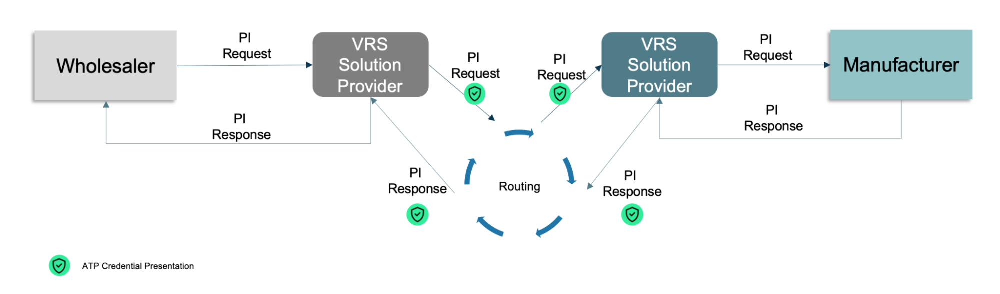
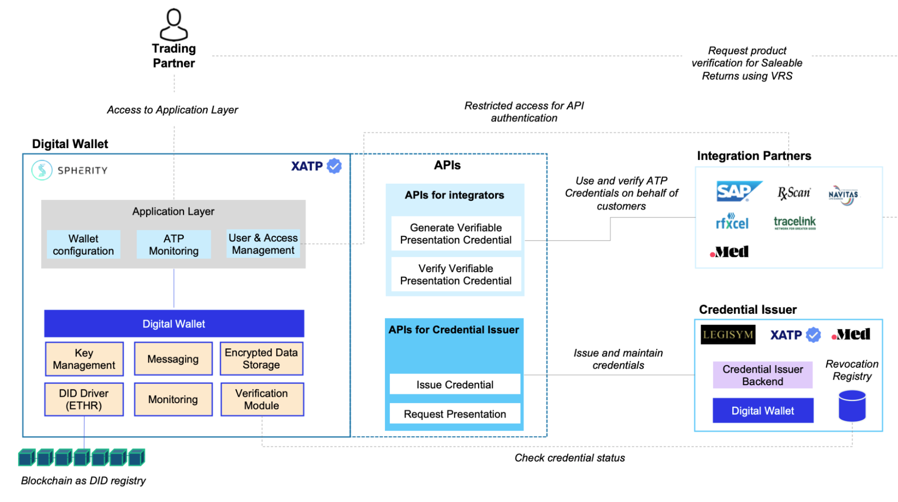

# Overview

The Drug Supply Chain Security Act mandates the development of an interoperable electronic system to secure the safety of prescription drugs distributed throughout the United States. One such requirement for this system is to confirm that trading partners only engage in transactions with other “authorized” trading partners. This presents a major challenge between ATPs, particularly when no prior direct business relationship exists. To address this challenge, the OCI ecosystem developed an architecture to check the ATP status between trading partners involved in automated verification for saleable returns.

OCI establishes technical governance, specifications, and guidelines to support industry-wide adoption of credentialing on common ground. By utilizing W3C-specified [Decentralized Identifiers](https://www.w3.org/TR/did-core/) (DIDs) and [Verifiable Credentials](https://www.w3.org/TR/vc-data-model/) (VCs), GS1 and open standards, OCI-maintained architecture achieves compliant and secure interactions between Authorized Trading Partners. 

OCI is open to DSCSA trading partners, solution providers, associations, and others who aim to leverage OCI architecture and specifications to support the safety, security, and efficiency of the supply chain.

# Use Case: PI Verification

## Background

Per the DSCSA as of November 2019, wholesale distributors are required to verify the product-level serial number on saleable returns before selling the product back into the supply chain. The manufacturer must make the serial numbers available for verification. It is estimated that 2 to 4% of pharmaceutical products sold in the US are returned to the wholesale distributors and are eligible to be sold back into the supply chain upon verification.

Due to this high volume, an industry-wide PI verification system was implemented to allow wholesale distributors to perform the verification. The existing PI verification system allows the exchange of messages between WHOs and MANs via various VRS service providers as the primary method for the verification of so-called *serialized GTINs* (sGTIN) automatically, with a sub-second messaging roundtrip requirement. The sGTIN is encoded in a GS1 2D DataMatrix and encodes the following data objects: GTIN, Expiration Date, Batch Number, and Serial Number (S/N). Response times in the actual system are up to 2 seconds.

VRS services are cloud-based, multi-tenant solutions that are integrated with the systems of wholesale distributors and manufacturers. To allow a seamless exchange of PI verification messages among WHOs, MANs, and VRS providers, the industry adopted the *GS1 Lightweight Messaging Standard* as a communication protocol among these systems.

When a saleable return arrives at the warehouse of a wholesale distributor, the 2D DataMatrix of each individual package needs to be scanned. After scanning a 2D DataMatrix in the warehouse system of the WHO, the WHO initiates a *PI verification request* (VR). This PI verification is sent to the WHO VRS service provider, which then determines a routing path by looking up a service endpoint URL and forwarding the PI request using a *Look-up Table and Routing Service Network* (e.g.  MediLedger) to the VRS of the MAN service provider. The MAN VRS queries PI data from the MAN system and then sends a PI verification request response (VR/R) back to the wholesale distributor.
The Look-up Table and Routing Service Network stores and maintains look-up data for mapping any sGTIN to the service endpoint of the relevant MANs.

## Compliance requirements

​​The existing PI Verification solutions do not fulfill all DSCSA requirements. The OCI recognizes that:

- The DSCSA requires manufacturers, repackagers, wholesale distributors and dispensers to only trade with companies that meet the DSCSA defined “Trading Partner” and “Authorized” definition.
- Compliance with the DSCSA will require supply chain companies to digitally interact with supply chain companies where the company identity and whether they meet the DSCSA defined “Trading Partner” and “Authorized” definition will be unknown at the time of interaction.
- To complete the interaction, it is essential for companies at both ends of a DSCSA digital interaction to know the identity of the other company and if the other company meets the DSCSA defined “Trading Partner” and “Authorized” definition.

The OCI uses W3C (World Wide Web Consortium) decentralized Identifiers (DIDs) and verifiable credentials (VCs) specification in conjunction with the GS1 Lightweight Messaging Standard to:

- Know the identity of PI Verification requesters and responders,
- Verify that the requestor or responder meets the DSCSA definition of “Trading Partner” and “Authorized”.
  
To fulfill the DSCSA requirements, the OCI uses the following components:

- W3C Decentralized Identifiers (DIDs),
- W3C Verifiable Credentials (VCs), and
- Digital Wallets.

These components are described in more detail in the following sections.

# System Overview

The OCI architecture integrates the three *new components* (DID, VC, and Digital Wallet) with components of the existing PI verification infrastructure.

Integration of these components requires the implementation of the following artefacts:

- Digital Wallets  
- Distributed ledger as trust fabric for anchoring DIDs
- GS1 Lightweight Messaging standard

The Digital Wallets is software that enables trading partners and credential issers to acquire, store, and present verifiable credentials and to mange their digital identity (DID). The Digital Wallet provider needs to expose APIs, so that VRS providers can integrate to use the ATP credentials in PI verifications. The OCI ensures that  there is no technical integration for Trading Partners required.

For acquiring credentials, wallets of trading partners need to interact with wallets of credential issuers. 

To exchange the ATP credential status between requesters and responders, the OCI uses the GS1 lightweight messages protocol without any change to this standard. The presentation of the ATP credential can be embedded as JSON Web Token into a custom header of the GS1 lightweight messages without changing the VR and VR/R payload bodies’ data structure.

# Architecture Overview

The diagram below describes how enterprise Digital Wallets are integrated with integrators such as VRS systems and credential issuers.

The VRS systems support various integration capabilities, such as content-based routing and mapping of the PI verification requests, and several connectivity options, providing standardized integration with other VRS providers. VRS systems are cloud-based multi-tenant solutions. 

Following the minimally invasive adoption principle, the Digital Wallets will be integrated via APIs to the VRS provider system so that ATP credentials can be attached to the GS1 lightweight verification protocol in the form of a JSON Web Token (JWT). For the management of ATP credentials, a web UI can be provided on the application layer. Consequently, there will be minimal customization requirements and changes to trading partner´s existing infrastructures.

Additional API integration will be implemented between the enterprise wallets and the Credential Issuers’ wallets for ATP credentials acquisition.

# Helpful Links

- OCI Website: oc-i.org
- OCI Conformance Criteria 
  - [Credential Issuers](https://open-credentialing-initiative.github.io/Credential-Issuer-Conformance-Criteria/) 
  - Digital Wallet provider (will be published soon on oc-i.org)
- Documentation of Spherity´s reference implementation: learn.spherity.com
- W3C standards: 
  - [Decentralized Identifier](https://www.w3.org/TR/did-core/)
  - [Verifiable Credentials](https://www.w3.org/TR/vc-data-model/)
  - [Verifiable Presentation](https://www.w3.org/TR/vc-data-model/)
- [GS1 Lightweight Messaging Standard for Verification of Product Identifiers](https://www.gs1.org/sites/default/files/docs/standards/gs1_lightweight_verification_messaging_standard_v1-1.pdf)
